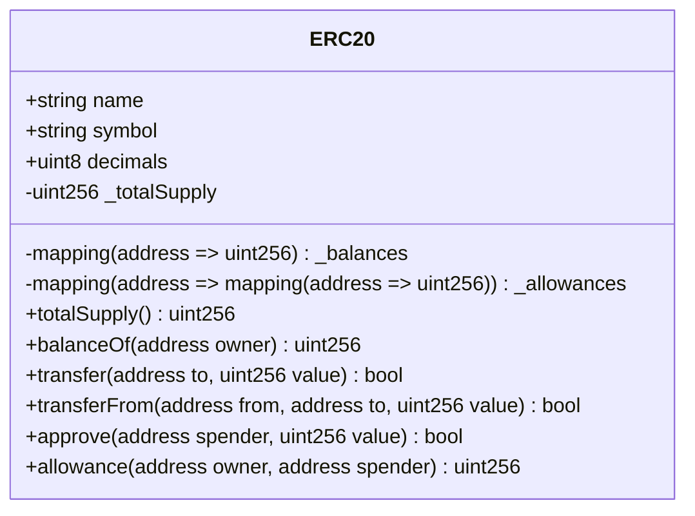

<!-- omit in toc -->
# Solidity Starter Kit
A repository for me to document my learning on solidity and smart contract

<!-- omit in toc -->
## Table of Contents
- [Setting up Solidity development environment locally](#setting-up-solidity-development-environment-locally)
- [Basic Blockchain Concept](#basic-blockchain-concept)
  - [Blockchain vs Traditional Systems](#blockchain-vs-traditional-systems)
- [Ethereum Fundamentals](#ethereum-fundamentals)
  - [Ether Units](#ether-units)
  - [Data Locations \& Best Practices](#data-locations--best-practices)
- [Functions](#functions)
  - [Structure](#structure)
  - [Visibility](#visibility)
  - [Constructor and Destructor Functions](#constructor-and-destructor-functions)
  - [Fallback Function](#fallback-function)
- [NatSpec Tags](#natspec-tags)
- [Token Standards](#token-standards)
  - [ERC20 \& Fungible Tokens](#erc20--fungible-tokens)
  - [ERC721 \& Non-Fungible Tokens](#erc721--non-fungible-tokens)

---

### Setting up Solidity development environment locally
Remix IDE (web-based) is tailored for Solidity Smart Contract development but it is not suited for full-fledged front-end development. I still prefer to do the development work locally whenever I need to build a proper project.

Install solidity
```bash
npm install -g solc
```

Install ganache for local blockchain simulator (allows quick contract testing without actual wallets)
```bash
npm install -g ganache
```

Initialize Node.js project
```bash
# Initialize Node.js project, this creates package.json and enables npm dependencies
# Make sure you are in your root folder
npm init -y 
```

Install hardhat locally for testing, compilation and deployment (alternatively, you can use Truffle but it is a sunset project)
```bash
npm install --save-dev hardhat @nomicfoundation/hardhat-toolbox
```

initialize hardhat project and automate the folder directory set up: it creates hardhat.config.js, contracts/ , scripts/ and test/ folders under the root directory
```bash
npx hardhat init
```
Now your project root folder will look something like the following:
```
your-project/
├── contracts/
├── scripts/
├── test/
├── hardhat.config.js
├── package.json
└── node_modules/
```

---

### Basic Blockchain Concept

A decentralized, public ledger where information (transactions, contracts, etc.) is recorded permanently.

**What is a "Block" and a "Chain"?**

- A **Block** = A batch of transactions that are grouped together, verified, and added to the ledger.
- A **Chain** = A sequence of blocks linked together, forming a history of all transactions.

Each block contains:

1. Transactions – Actions like payments, smart contract executions, or NFT transfers.
2. A Reference to the Previous Block – This links it to the previous block, forming a chain.
3. A Unique Code (Hash) – A digital fingerprint ensuring the block's integrity.
4. Once a block is added to the chain, it cannot be changed—which is what makes blockchain secure and trustworthy.

<br>

#### Blockchain vs Traditional Systems

| Feature          | Traditional Systems (Banks, Cloud, etc.) | Blockchain (Decentralized, On-Chain) |
|-----------------|----------------------------------|--------------------------------|
| **Control**      | Centralized authority (bank, company) | No single owner, fully distributed |
| **Security**     | Can be hacked, single point of failure | Highly secure, no central point to attack |
| **Trust**        | Requires trust in institutions | Trustless, automated verification |
| **Transparency** | Private records | Fully public and auditable |
| **Data Changes** | Can be altered/deleted | Immutable, cannot be changed |
| **Middlemen**    | Needed (banks, payment processors) | Not needed, peer-to-peer transactions |
| **Availability** | Can go offline | Always online as long as nodes exist |

--- 

### Ethereum Fundamentals

#### Ether Units

Ether Units Explained:
- **Ether**: The main currency of Ethereum
- **Wei**: The smallest unit of Ether
  - 1 Ether = 1,000,000,000,000,000,000 wei (1e18 wei)
- **Gwei**: Commonly used for gas prices
  - 1 Gwei = 1,000,000,000 wei (1e9 wei)
  - 1 Ether = 1,000,000,000 Gwei

<br>


#### Data Locations & Best Practices

1. **Storage**
   - Persistent storage (like a hard drive)
   - Most expensive gas cost
   - State variables are storage by default
   - Persists between function calls

2. **Memory**
   - Temporary storage (like RAM)
   - Medium gas cost
   - Cleared after function execution
   - Used for function parameters and local variables

3. **Calldata**
   - Read-only temporary storage
   - Lowest gas cost
   - Used for function parameters
   - Cannot be modified

---

### Functions

#### Structure
- Input parameters
- Access Modifiers
- Output Parameters
  
<br>

#### Visibility

- `external`: It is part of our contract's interface and can be called from other contracts or transactions, but <u>cannot be called from within the contract</u> or at least not without an explicit reference to the object it is being called on.

- `public`: They can be called from other contracts or transactions, but additionally they <u>can be called internally</u>. This means you can use an implicit receiver of the message when invoking the method inside of a method.

- `internal` & `private`: Must use the implicit receiver or, in other words, **cannot be called on an object or on this**. The main difference between these two modifiers is that private functions are only visible within the contract in which they are defined, and not in derived contracts.

- `pure` & `view`: Will not alter the state of the contract's variables. `pure` functions do not read from the blockchain. They operate on data passed in or do not need any input. `view` functions can read data from the blockchain but they cannot write to the blockchain.

- `memory`: Not referencing anything located in our contract's persisted storage.

- `calldata`: Only needed when the function is declared as external and when the data type of the parameter is a reference type such as a mapping, struct, string, or array. Using value types like int or address do not require this label.

<br>

#### Constructor and Destructor Functions
- A constructor is called to initialize the smart contract when the smart contract is deployed.


<br>

#### Fallback Function
- A contract can have **exactly one** fallback function
- An unnamed external function without any input or output parameters
- Executes the fallback function if none of the other functions match the intended function calls


---

### NatSpec Tags

- **@title**  
  - **Purpose:** Provides a concise title or summary of the contract.  
  - **When to Use:** Always include this at the top of your contract so users quickly understand its purpose.

- **@dev**  
  - **Purpose:** Offers additional technical details meant for developers.  
  - **When to Use:** Use this to explain implementation details, inner workings, or important notes that are not immediately obvious from the code. This is especially useful for auditing or future maintenance.

- **@notice**  
  - **Purpose:** Describes what the contract or function does in user-friendly language.  
  - **When to Use:** Include it to inform end users or non-developer stakeholders about the behavior or purpose without exposing intricate internal details.

- **@param**  
  - **Purpose:** Documents function parameters; it describes the purpose of each argument passed to a function.  
  - **When to Use:** Always include one `@param` tag per parameter when a function accepts one or more parameters, specifying the parameter name and its role.

- **@return**  
  - **Purpose:** Explains what a function returns.  
  - **When to Use:** Use it in functions that return data to clarify what the returned value represents.

---

### Token Standards

#### ERC20 & Fungible Tokens

**Basic Concept:**

Fungible tokens are digital assets that are interchangeable with each other and have **<u>uniform value</u>**, i.e., each token holds the same value as another of its kind (e.g., 1 USDT = 1 USDT). Apart from interchangeability, other key characteristics include:

- Can be broken into smaller units (e.g., 0.0001 ETH)
- Should be built using predefined smart contract standards (e.g., ERC20)
- Easily traded on exchanges and used for transactions (liquidity)

ERC20 defines a standard set of functions and events that all **<u>fungible tokens</u>** should implement. Fungible means that each token is **<u>interchangeable</u>** with another (like currency, a.k.a **代币**).

This standard allows different tokens to interact with decentralized applications (dApps), exchanges, and other smart contracts in a consistent and predictable manner. Wallets and exchanges can easily integrate any **<u>ERC20-compliant</u>** token.

It provides the basic functionality for <u>transferring tokens, approving spending by other accounts, and querying balances and total supply.</u>

The ERC20 contract in OpenZeppelin is often implemented as an **<u>abstract contract</u>** because it provides a basic framework but leaves some implementation details to be defined in derived contracts, e.g., Lab2's example. Note that abstract contract cannot be deployed directly.

**ERC20 Token Standard Interface**



<br>


#### ERC721 & Non-Fungible Tokens
  <br>
  
  **Basic Concept:**
  <br>

  Non-fungible tokens (NFTs) are unique digital assets where **<u>no two tokens are identical</u>**. Unlike fungible tokens, each NFT has distinct characteristics and value. Key characteristics include:

  - Each token has a unique identifier (tokenId)
  - Cannot be subdivided (1 NFT remains 1 NFT)
  - Built using standards like ERC721 or ERC1155
  - Often represents ownership of digital or real-world assets

  <br>
  
  ERC721 defines the standard for **<u>non-fungible tokens</u>** on Ethereum. Each token is **<u>unique</u>** and represents distinct ownership (like digital art, collectibles, or real estate, a.k.a **非同质化代币**).

  This standard enables NFTs to be traded on marketplaces and integrated into various applications while maintaining their unique properties and ownership history.

  It provides functionality for <u>minting, transferring, and managing unique tokens, with each token having its own distinct ID and metadata</u>.

  <br>

  **ERC721 Token Standard Interface**

  ```mermaid
  classDiagram
      class ERC721 {
          +string name
          +string symbol
          -mapping(uint256 => address) _owners
          -mapping(address => uint256) _balances
          -mapping(uint256 => address) _tokenApprovals
          -mapping(address => mapping(address => bool)) _operatorApprovals
          
          +balanceOf(address owner) uint256
          +ownerOf(uint256 tokenId) address
          +safeTransferFrom(address from, address to, uint256 tokenId, bytes data)
          +safeTransferFrom(address from, address to, uint256 tokenId)
          +transferFrom(address from, address to, uint256 tokenId)
          +approve(address to, uint256 tokenId)
          +setApprovalForAll(address operator, bool approved)
          +getApproved(uint256 tokenId) address
          +isApprovedForAll(address owner, address operator) bool
      }
  ```


<br>


  ERC20 VS ERC721

  Key differences between ERC20 and ERC721:

  | Feature | ERC20 (Fungible) | ERC721 (Non-Fungible) |
  |---------|------------------|----------------------|
  | Uniqueness | All tokens identical | Each token unique |
  | Divisibility | Can be split (e.g., 0.5) | Cannot be split |
  | ID | No individual IDs | Each token has unique ID |
  | Value | Equal value per token | Value varies by token |
  | Transfer | Simple transfer | Transfer with specific ID |
  | Use Case | Currency, shares | Collectibles, art, property |

<br>

