<!-- omit in toc -->
# Solidity Starter Kit
A repository for me to document my learning on solidity and smart contract

<!-- omit in toc -->
## Table of Contents
- [Setting up Solidity development environment locally](#setting-up-solidity-development-environment-locally)
- [Basic Blockchain Concept](#basic-blockchain-concept)
  - [Blockchain vs Traditional Systems](#blockchain-vs-traditional-systems)
  - [Solving Double Spending](#solving-double-spending)
  - [Proof-of-work mechanism](#proof-of-work-mechanism)
  - [Wallet](#wallet)
  - [Hash function](#hash-function)
  - [Transaction](#transaction)
  - [UTXO (Unspent Transaction Output)](#utxo-unspent-transaction-output)
- [Ethereum Fundamentals](#ethereum-fundamentals)
  - [Ether Units](#ether-units)
  - [Ethereum and Smart Contract](#ethereum-and-smart-contract)
  - [Gas Fee](#gas-fee)
  - [Account and Address](#account-and-address)
  - [Transaction](#transaction-1)
  - [Transaction Life Cycle](#transaction-life-cycle)
  - [Data Locations \& Best Practices](#data-locations--best-practices)
- [Functions](#functions)
  - [Structure](#structure)
  - [Visibility](#visibility)
  - [Constructor and Destructor Functions](#constructor-and-destructor-functions)
  - [Fallback Function](#fallback-function)
  - [Function overloading](#function-overloading)
  - [Function Modifier](#function-modifier)
- [Events](#events)
- [Global \& Contextual Variables (and functions)](#global--contextual-variables-and-functions)
- [NatSpec Tags](#natspec-tags)
- [Understanding inheritance, abstract contracts and interfaces](#understanding-inheritance-abstract-contracts-and-interfaces)
  - [Interfaces](#interfaces)
  - [Abstract Contracts](#abstract-contracts)
  - [Inheritance](#inheritance)
  - [Function overriding](#function-overriding)
- [Token Standards](#token-standards)
  - [ERC20 \& Fungible Tokens](#erc20--fungible-tokens)
  - [ERC721 \& Non-Fungible Tokens](#erc721--non-fungible-tokens)
- [Vulnerability](#vulnerability)
  - [Reentrancy Attacks](#reentrancy-attacks)
  - [Reentrancy Mitigation](#reentrancy-mitigation)
  - [Stack Size Limit](#stack-size-limit)
  - [Blockchain Level Unpredictable State](#blockchain-level-unpredictable-state)
- [Client(Node) APIs](#clientnode-apis)
  - [Types of Ethereum Nodes](#types-of-ethereum-nodes)
  - [Frequently used APIs](#frequently-used-apis)
- [Ethereum Characteristics](#ethereum-characteristics)
  - [EVM bytecode](#evm-bytecode)
  - [ABI (Application Binary Interface)](#abi-application-binary-interface)
- [Wallets](#wallets)
---

### Setting up Solidity development environment locally
Remix IDE (web-based) is tailored for Solidity Smart Contract development but it is not suited for full-fledged front-end development. I still prefer to do the development work locally whenever I need to build a proper project.

Install solidity
```bash
npm install -g solc
```

Install ganache for local blockchain simulator (allows quick contract testing without actual wallets)
```bash
npm install -g ganache
```

Initialize Node.js project
```bash
# Initialize Node.js project, this creates package.json and enables npm dependencies
# Make sure you are in your root folder
npm init -y 
```

Install hardhat locally for testing, compilation and deployment (alternatively, you can use Truffle but it is a sunset project)
```bash
npm install --save-dev hardhat @nomicfoundation/hardhat-toolbox
```

initialize hardhat project and automate the folder directory set up: it creates hardhat.config.js, contracts/ , scripts/ and test/ folders under the root directory
```bash
npx hardhat init
```
Now your project root folder will look something like the following:
```
your-project/
├── contracts/
├── scripts/
├── test/
├── hardhat.config.js
├── package.json
└── node_modules/
```

---

### Basic Blockchain Concept

A decentralized, public ledger where information (transactions, contracts, etc.) is recorded permanently.

**What is a "Block" and a "Chain"?**

- A **Block** = A batch of transactions that are grouped together, verified, and added to the ledger.
- A **Chain** = A sequence of blocks linked together, forming a history of all transactions.

Each block contains:

1. Transactions – Actions like payments, smart contract executions, or NFT transfers.
2. A Reference to the Previous Block – This links it to the previous block, forming a chain.
3. A Unique Code (Hash) – A digital fingerprint ensuring the block's integrity.
4. Once a block is added to the chain, it cannot be changed—which is what makes blockchain secure and trustworthy.

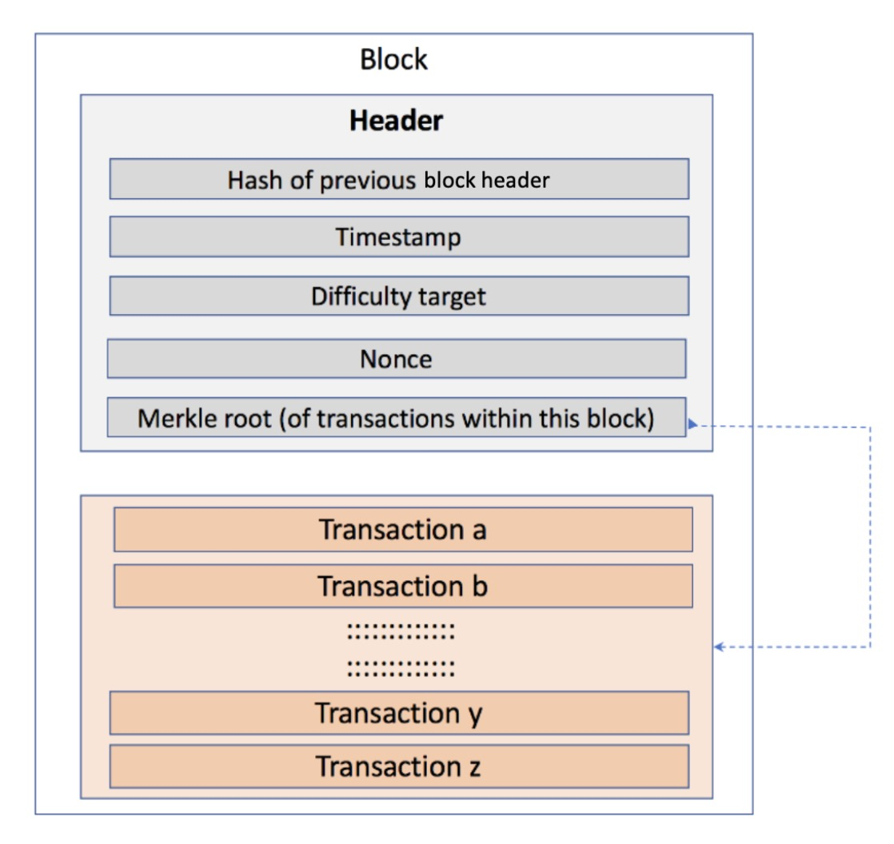
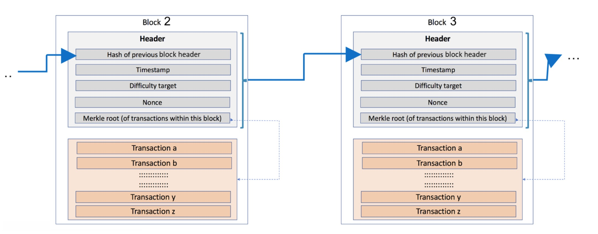
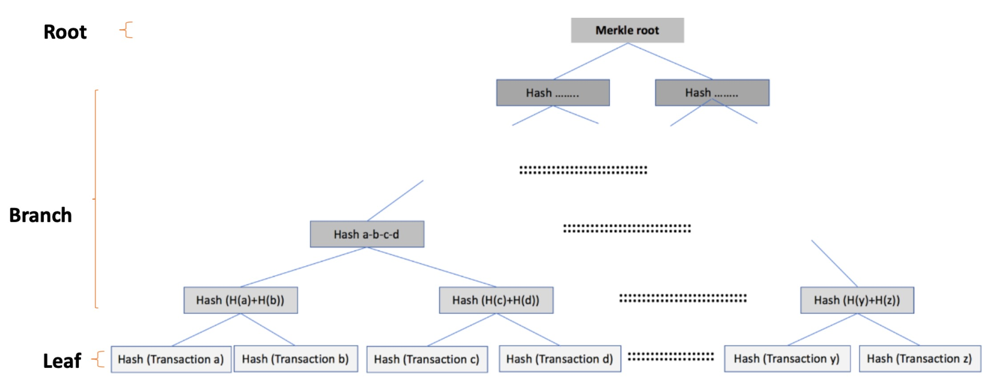

<br>

#### Blockchain vs Traditional Systems

| Feature          | Traditional Systems (Banks, Cloud, etc.) | Blockchain (Decentralized, On-Chain) |
|-----------------|----------------------------------|--------------------------------|
| **Control**      | Centralized authority (bank, company) | No single owner, fully distributed |
| **Security**     | Can be hacked, single point of failure | Highly secure, no central point to attack |
| **Trust**        | Requires trust in institutions | Trustless, automated verification |
| **Transparency** | Private records | Fully public and auditable |
| **Data Changes** | Can be altered/deleted | Immutable, cannot be changed |
| **Middlemen**    | Needed (banks, payment processors) | Not needed, peer-to-peer transactions |
| **Availability** | Can go offline | Always online as long as nodes exist |

<br>

#### Solving Double Spending

illustration:
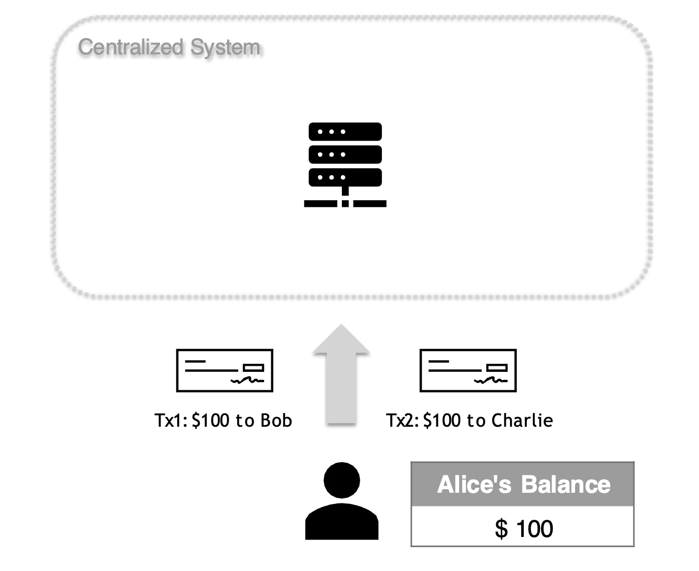

**Possible Solutions:**
1. A leader decides the order of the transaction (the event of a leader server failure?)
2. A leader decides the order of transactions **+** The next server becomes a leader if the current leader doesn't suggest the next
transaction for 10 seconds (What if one server may believe the leader has changed, while another may not?)
3. A leader decides the order of transactions **+** The next server becomes a leader if the current leader doesn't suggest a next
transaction for 10 seconds **+** A leader collects confirmations from other servers about the order suggestion (what if a server lies?)

<br>

**Concensus Algorithm:**
- Bitcoin uses the Nakamoto consensus mechanism: a combination of **Proof-of-work** and **Longest chain rule**
- Ethereum switched a Proof-of-Stake mechanism since Sept 2022, claims to have reduced energy consumption significantly compared to PoW, while maintaining network security through economic incentives.

#### Proof-of-work mechanism
1. **Block Formation**
   - Transaction Collection: Miners collect pending transactions and organize them into a block.

   - Block Header: This contains metadata such as the previous block's hash, a timestamp, the Merkle root of the transactions, a nonce, and other fields.

2. **The Hash Puzzle**
   - Hash Function: The block header is fed into a cryptographic hash function (Bitcoin uses SHA-256) which produces a fixed-size output (a hash).

   - Difficulty Target: The network sets a difficulty target. For a block to be valid, its hash must be lower than this target. In practice, this is often represented as the hash having a certain number of leading zeros.

   - Nonce: The nonce is a number that miners adjust to change the block header's hash output. By incrementing the nonce, miners generate different hashes until one meets the difficulty condition.

3. **The Mining Process**
   - Iteration: Miners try different nonce values (and sometimes adjust other parts of the block header) in a trial-and-error process.

   - Computational Work: Because there is no shortcut to predict the correct nonce, miners must compute many hashes until they find one that satisfies the condition. This work is deliberately resource-intensive.

   - Block Broadcast: Once a valid nonce is found, the block is broadcast to the network for validation. Other nodes check the block's hash and confirm that it meets the difficulty criteria.

4. **Security and Consensus**
   - Costly Attack: The high computational cost makes it economically impractical for an attacker to alter past blocks since they would need to redo the work for that block and all subsequent blocks.

   - Longest Chain Rule: The network follows the chain with the most accumulated work, ensuring that the block with valid proof-of-work is accepted even if two blocks are found nearly simultaneously.

#### Wallet
- A bitcoin address is a 26-62 an alphanumeric character identifier (depending on the network and tools)
- **Private key:** used by the sender of bitcoins to prove the ownership of bitcoins
- **Public key:** used by anyone in the bitcoin network to verify ownerships of bitcoins
- A key pair can be used for **Digital Signature** and Encryption/Decryption

<br>

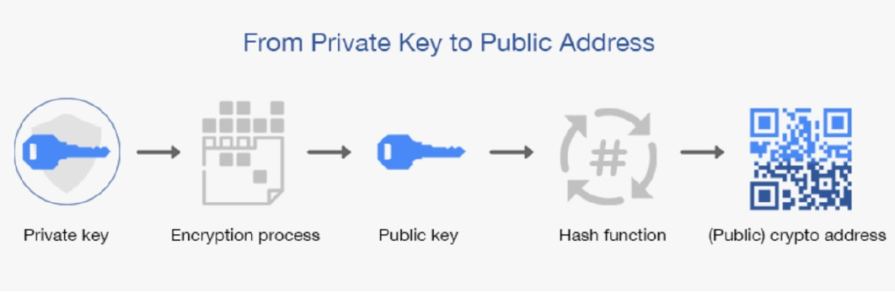

#### Hash function
- It computes a unique identifier for a piece of data
- Used to check the integrity of data
- Use cases for Bitcoin:
  - Making a fixed-length address
  - Compress the signing data of a transaction

#### Transaction
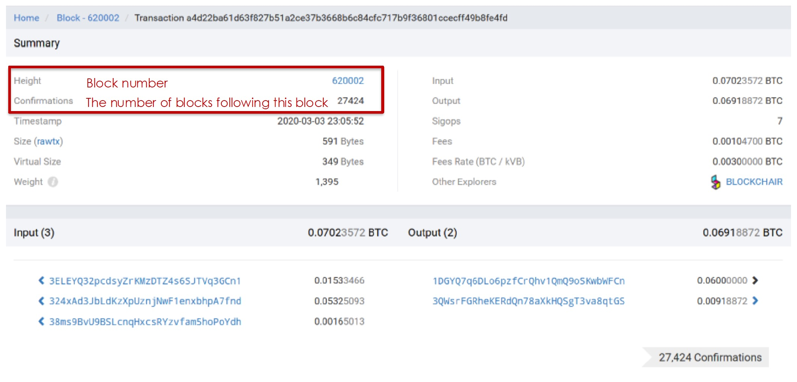
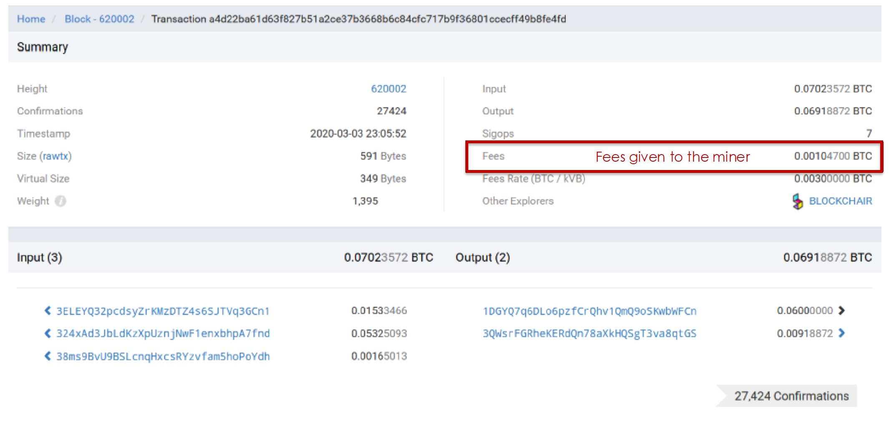

<br>

**Fees:**
- Compensate miners for the node operation
- Make economically infeasible for attackers to flood the network with transactions
- A sender specifies the fee of his/her transaction
- Miner chooses the transaction he/she wants to mine
- The priority of transactions based on many different criteria, including fees
- Transaction fees = Inputs – Outputs
- Minimum can be set like 0.00001 BTC per kilobyte

#### UTXO (Unspent Transaction Output)
- Digital version of cash transactions
- Instead of having an account balance, Bitcoin keeps track of individual “coins” (or portions of coins) that can be spent
- Inputs and Outputs: A transaction consumes one or more UTXOs (inputs) and produces new UTXOs (outputs).
  - Example: If you want to pay 0.5 BTC, you might use a 1 BTC UTXO. Your transaction will have:
    - Input: 1 BTC from a previous transaction.
    - Outputs: One output of 0.5 BTC to the recipient and another output of 0.5 BTC as “change” back to you.

- No Overlap: Each UTXO can only be spent once. Once it’s used in a transaction, it’s considered “spent” and cannot be reused.

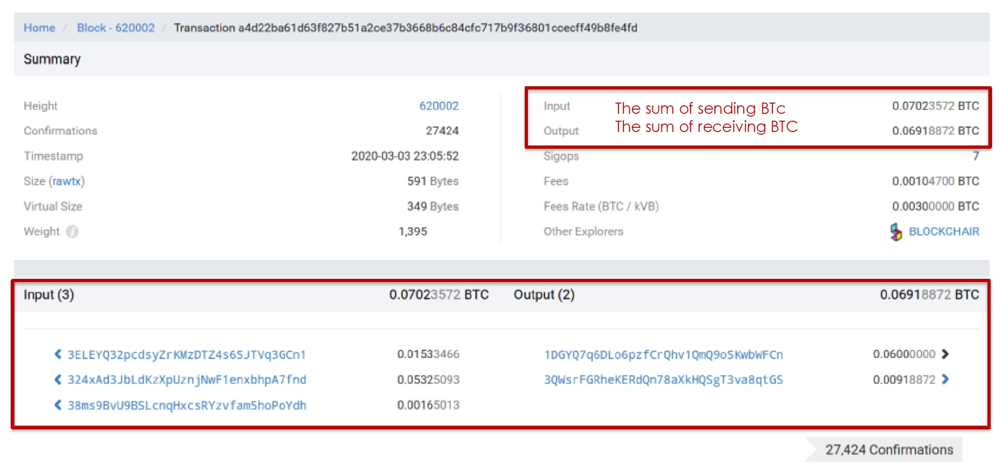
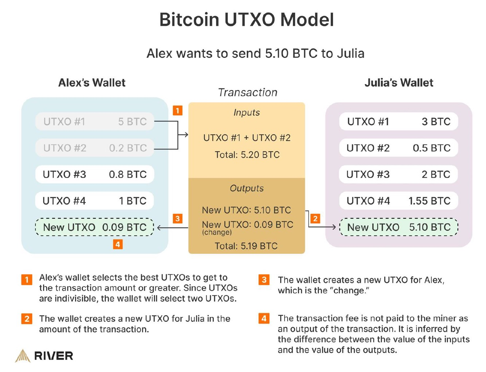

--- 

### Ethereum Fundamentals

> "What Ethereum intends to provide is a blockchain with a built-in fully fledged Turing-complete programming language that can be used to create 'contracts' that can be used to encode arbitrary state transition functions" &mdash; Ethereum whitepaper

**Ethereum Virtual Machine (EVM)** is a decentralized runtime environment that executes smart contracts on the blockchain, ensuring that all nodes in the network achieve consensus on the computation results.


#### Ether Units

Ether Units Explained:
- **Ether**: The main currency of Ethereum
- **Wei**: The smallest unit of Ether
  - 1 Ether = 1,000,000,000,000,000,000 wei (1e18 wei)
- **Gwei**: Commonly used for gas prices
  - 1 Gwei = 1,000,000,000 wei (1e9 wei)
  - 1 Ether = 1,000,000,000 Gwei

<br>

#### Ethereum and Smart Contract
- Each contract contains EVM bytecode and maintains its own storage
  - EVM bytecode is immutable after the deployment (it can SELFDESTRUCT, though)
  - Storage can be updated by transactions

<br>

- Ethereum Virtual Machine (EVM) as a State Machine
  - The global state consists of all accounts, balances, contract code, and storage at any given moment
  - The state changes when a transaction is processed

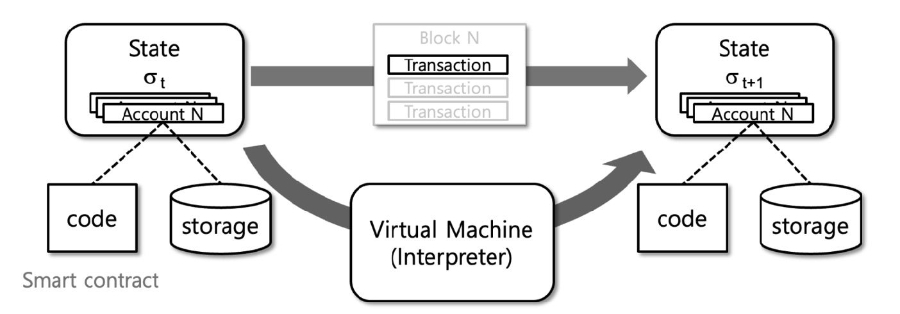

<br>

#### Gas Fee
Every operation in Ethereum consumes a specific amount of gas

- Users must pay for the gas required for their transactions to be processed
  - Total Gas Cost = Gas Used X Gas Price
  - Total Gas Cost (fee): How much a user need to pay with the native coin
  - Gas Used: The number of gas units used to execute the transaction
  - Gas Price: The price of gas, measured in Gwei (1 Gwei = 0.000000001 ETH)

<br>

- Users specify the maximum cost they can pay for their transactions
  - Max Fee = Gas Limit X Gas Price
    - Max Fee: Users can specify a maximum fee they are willing to pay
    - Gas Limit: The maximum amount of gas the user is willing to spend for the transaction. It is hard to estimate the exact “Gas Used”
    - Gas Price: The price the user is willing to pay per unit of gas. The higher the gasPrice, the faster the transaction will be mined by the miners/validators

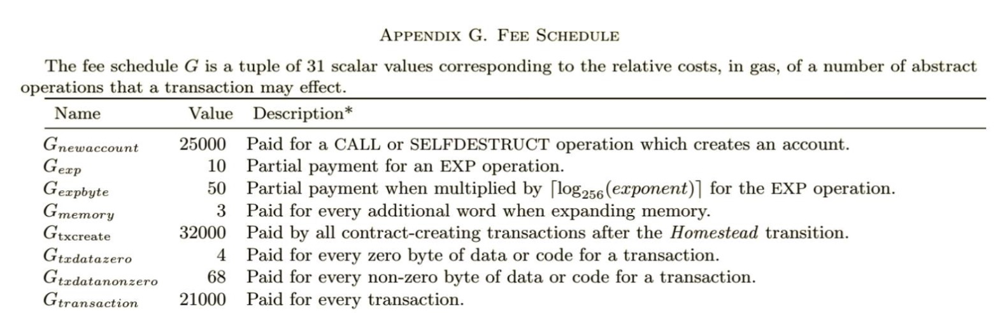

<br>

#### Account and Address
*   Ethereum has two types of accounts: EOA and SA

*   An **Externally Owned Account (EOA)** is typically created through a wallet
    *   ECDSA with the secp256k1 curve is used for EOA accounts, similar to Bitcoin
    *   An address of EOA is also derived from the public key, but the processing is different
        *   Ethereum address calculation: `Keccak-256(PubKey)[12:]`
        *   Bitcoin address calculation: `Base58Check(RIPEMD160(SHA256(PubKey)))`

*   A **Smart Contract (SA)** is created by a transaction deploying the smart contract code
    *   Smart Contract address calculation: `Keccak-256(SenderAddress||Nonce)[12:0]`

<br>

#### Transaction

*   A transaction is a signed message that contains data necessary for transferring native tokens (ETH), interacting with smart contracts
*   Transactions are the fundamental unit of communication between accounts
    *   Only EOAs can initiate transactions
        *   EOA -> EOA/SA
        *   EOA -> SA -> SA -> EOA
        *   (Impossible) SA -> EOA/SA
*   Currently, there are three types of transactions:
    *   Type 0 (legacy), Type 1 (AccessList, EIP-2930), and Type 2 (DynamicFee, EIP-1559)
    *   All transaction types are still supported, with the main differences being related to gas fee optimization

<br>

#### Transaction Life Cycle

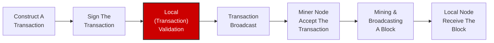
```mermaid
graph LR
    A["Construct A<br>Transaction"];
    B["Sign The<br>Transaction"];
    C["Local<br>(Transaction)<br>Validation"];
    D["Transaction<br>Broadcast"];
    E["Miner Node<br>Accept The<br>Transaction"];
    F["Mining &<br>Broadcasting<br>A Block"];
    G["Local Node<br>Receive The<br>Block"];

    A --> B;
    B --> C;
    C --> D;
    D --> E;
    E --> F;
    F --> G;

    %% Style the Local Validation node to be red
    style C fill:#cc0000,stroke:#333,stroke-width:2px,color:#fff;
```

#### Data Locations & Best Practices

1. **Storage**
   - Persistent storage (like a hard drive)
   - Most expensive gas cost
   - State variables are storage by default
   - Persists between function calls

2. **Memory**
   - Temporary storage (like RAM)
   - Medium gas cost
   - Cleared after function execution
   - Used for function parameters and local variables

3. **Calldata**
   - Read-only temporary storage
   - Lowest gas cost
   - Used for function parameters
   - Cannot be modified

---

### Functions

#### Structure
- Input parameters
- Access Modifiers
- Output Parameters
  
<br>

#### Visibility

- `external`: It is part of our contract's interface and can be called from other contracts or transactions, but <u>cannot be called from within the contract</u> or at least not without an explicit reference to the object it is being called on.

- `public`: They can be called from other contracts or transactions, but additionally they <u>can be called internally</u>. This means you can use an implicit receiver of the message when invoking the method inside of a method.

- `internal` & `private`: Must use the implicit receiver or, in other words, **cannot be called on an object or on this**. The main difference between these two modifiers is that private functions are only visible within the contract in which they are defined, and not in derived contracts.

- `pure` & `view`: Will not alter the state of the contract's variables. `pure` functions do not read from the blockchain. They operate on data passed in or do not need any input. `view` functions can read data from the blockchain but they cannot write to the blockchain.

- `memory`: Not referencing anything located in our contract's persisted storage.

- `calldata`: Only needed when the function is declared as external and when the data type of the parameter is a reference type such as a mapping, struct, string, or array. Using value types like int or address do not require this label.

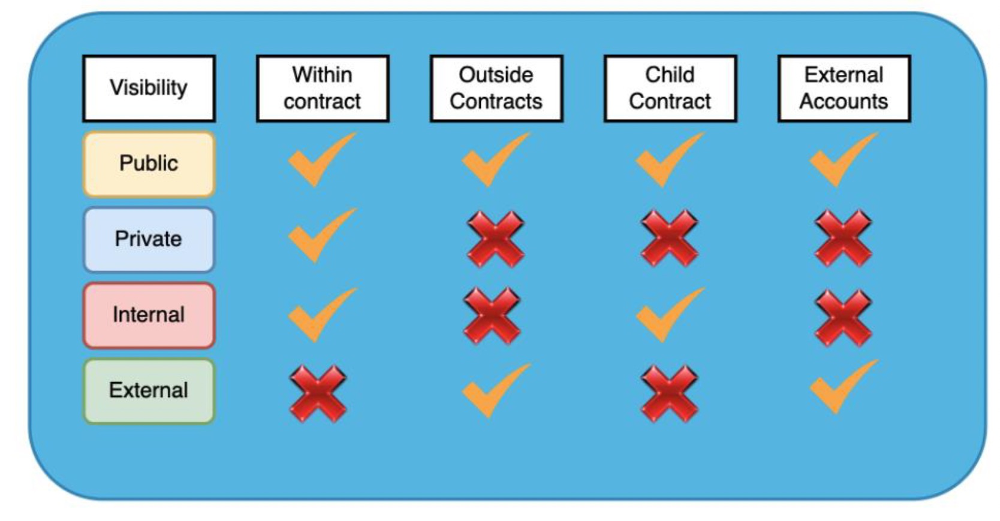

<br>

#### Constructor and Destructor Functions
- A constructor is called to initialize the smart contract when the smart contract is deployed.

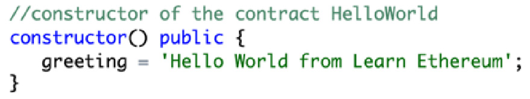

<br>

#### Fallback Function
- A contract can have **exactly one** fallback function
- An unnamed external function without any input or output parameters
- Executes the fallback function if none of the other functions match the intended function calls

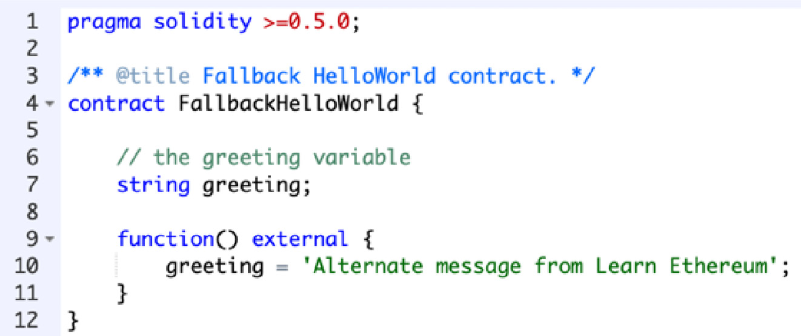

<br>

#### Function overloading
- you may define multiple functions with the same name but with different input parameter types
- Return types don’t count as part of the overloading resolution.
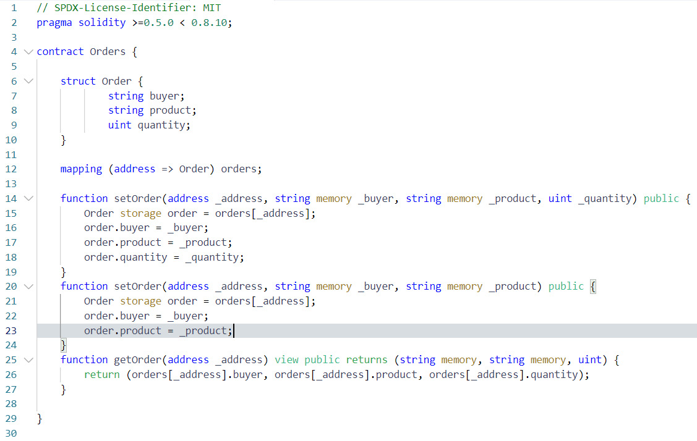

<br>

#### Function Modifier
- Similar to Aspect-oriented programming
- Change or augment the behavior of a function
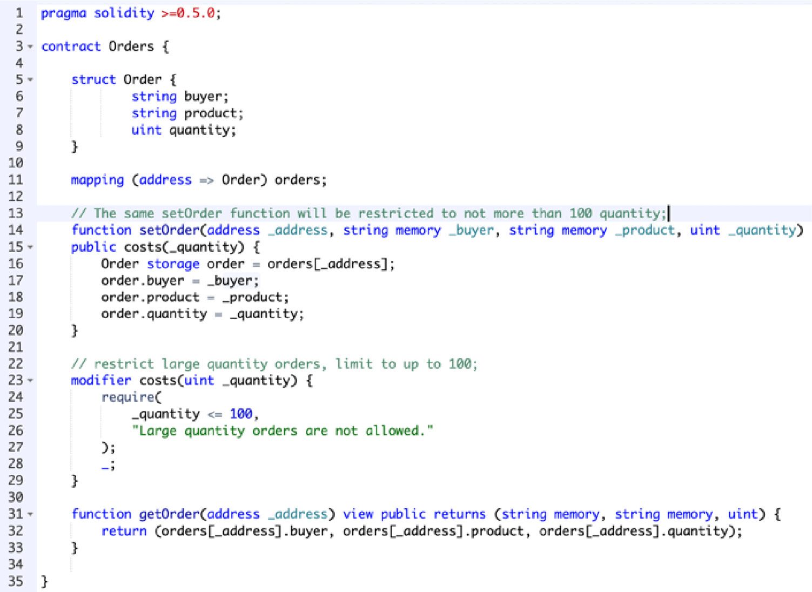

---


### Events
- Used to track the execution of a transaction that’s sent to a contract
- DApps can subscribe and listen to these events through the Web3 JSON-RPC interface

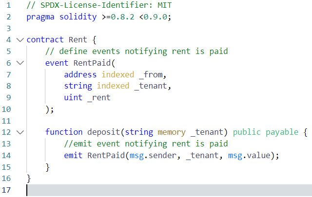

---

### Global & Contextual Variables (and functions)

| Variable/Function | Type | Description |
|-------------------|------|-------------|
| `blockhash(uint blockNumber)` | `bytes32` | Returns the hash of the given block. Only works for the 256 most recent blocks, excluding current. |
| `block.coinbase` | `address payable` | Returns the current block miner's address. |
| `block.difficulty` | `uint` | Returns the current block's difficulty. |
| `block.gaslimit` | `uint` | Returns the current block's gas limit. |
| `block.number` | `uint` | Returns the current block's number. |
| `block.timestamp` | `uint` | Returns the current block's timestamp in seconds since Unix epoch. |
| `gasleft()` | `uint256` | Returns remaining gas in current execution. |
| `msg.data` | `bytes calldata` | Returns complete call data. |
| `msg.sender` | `address payable` | Returns the sender of the message (current call). |
| `msg.sig` | `bytes4` | Returns the first four bytes of the call data (function identifier). |
| `msg.value` | `uint` | Returns the number of Wei sent with the message. |
| `now` | `uint` | Returns the current block timestamp (alias for block.timestamp). |
| `tx.gasprice` | `uint` | Returns the gas price of the transaction. |
| `tx.origin` | `address payable` | Returns the sender of the transaction (full call chain). |

---

### NatSpec Tags

- **@title**  
  - **Purpose:** Provides a concise title or summary of the contract.  
  - **When to Use:** Always include this at the top of your contract so users quickly understand its purpose.

- **@dev**  
  - **Purpose:** Offers additional technical details meant for developers.  
  - **When to Use:** Use this to explain implementation details, inner workings, or important notes that are not immediately obvious from the code. This is especially useful for auditing or future maintenance.

- **@notice**  
  - **Purpose:** Describes what the contract or function does in user-friendly language.  
  - **When to Use:** Include it to inform end users or non-developer stakeholders about the behavior or purpose without exposing intricate internal details.

- **@param**  
  - **Purpose:** Documents function parameters; it describes the purpose of each argument passed to a function.  
  - **When to Use:** Always include one `@param` tag per parameter when a function accepts one or more parameters, specifying the parameter name and its role.

- **@return**  
  - **Purpose:** Explains what a function returns.  
  - **When to Use:** Use it in functions that return data to clarify what the returned value represents.

---

### Understanding inheritance, abstract contracts and interfaces

#### Interfaces
- Can extend from other interfaces, but it cannot inherit from other contracts
- Doesn’t have any function with an implementation
- All declared functions in an interface must be external
- Doesn’t have a constructor
- Cannot declare state variables
- Cannot declare modifiers

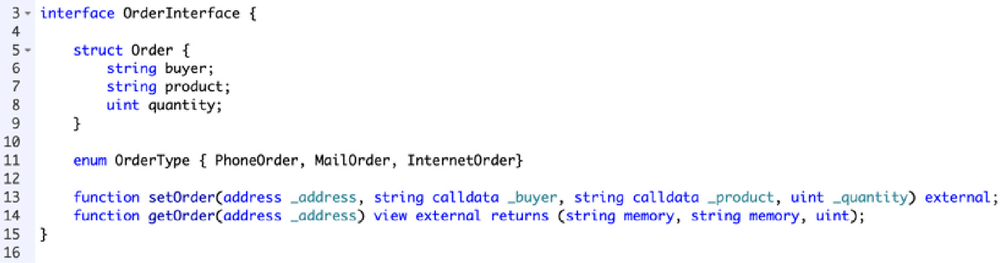

#### Abstract Contracts
- Similar to abstract class
- Defines all the methods for a contract to implement

#### Inheritance
- Can extend from other contracts, abstract contracts, or interfaces

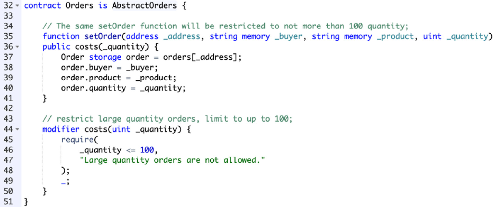

#### Function overriding
- Ability of one method in the subcontract to override the behaviors of the same method on the base contract

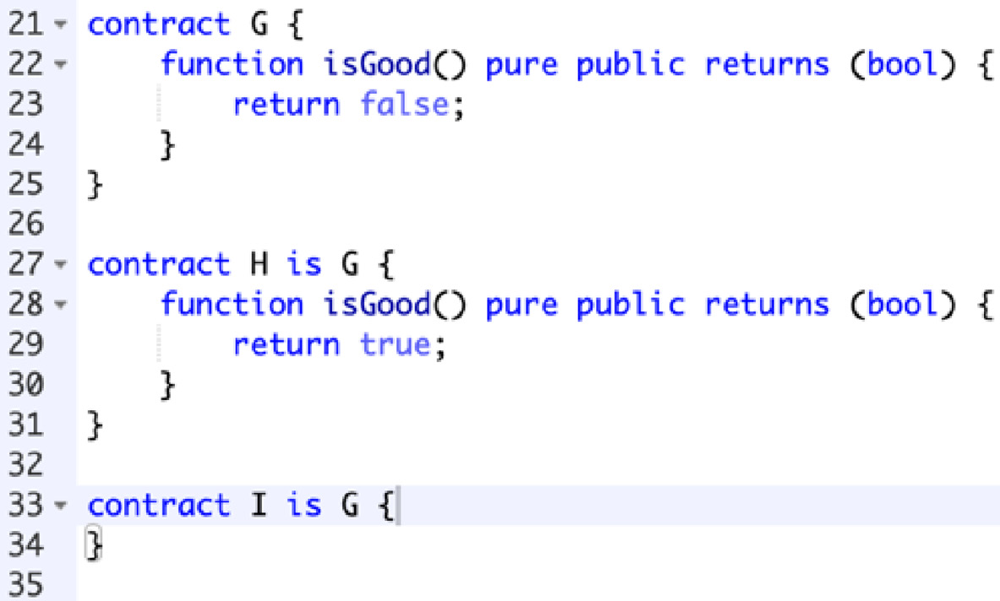

---

### Token Standards

#### ERC20 & Fungible Tokens

**Basic Concept:**

Fungible tokens are digital assets that are interchangeable with each other and have **<u>uniform value</u>**, i.e., each token holds the same value as another of its kind (e.g., 1 USDT = 1 USDT). Apart from interchangeability, other key characteristics include:

- Can be broken into smaller units (e.g., 0.0001 ETH)
- Should be built using predefined smart contract standards (e.g., ERC20)
- Easily traded on exchanges and used for transactions (liquidity)

ERC20 defines a standard set of functions and events that all **<u>fungible tokens</u>** should implement. Fungible means that each token is **<u>interchangeable</u>** with another (like currency, a.k.a **代币**).

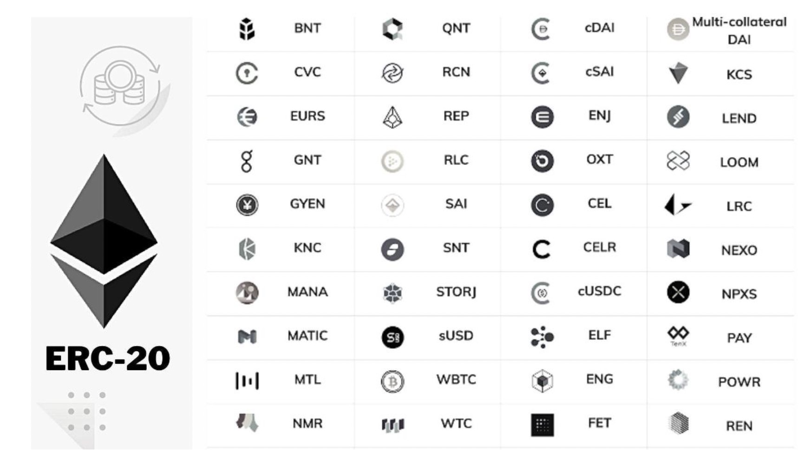

This standard allows different tokens to interact with decentralized applications (dApps), exchanges, and other smart contracts in a consistent and predictable manner. Wallets and exchanges can easily integrate any **<u>ERC20-compliant</u>** token.

It provides the basic functionality for <u>transferring tokens, approving spending by other accounts, and querying balances and total supply.</u>

The ERC20 contract in OpenZeppelin is often implemented as an **<u>abstract contract</u>** because it provides a basic framework but leaves some implementation details to be defined in derived contracts, e.g., Lab2's example. Note that abstract contract cannot be deployed directly.

**ERC20 Token Standard Interface**

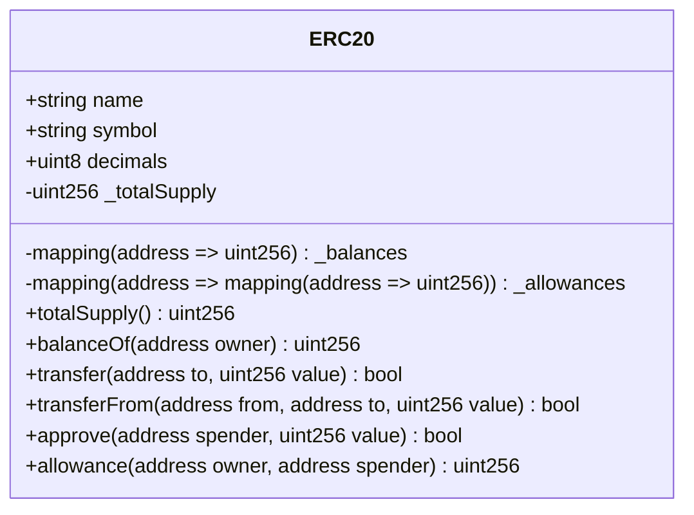
```mermaid
classDiagram
    class ERC20 {
        +string name
        +string symbol
        +uint8 decimals
        -uint256 _totalSupply
        -mapping(address => uint256) _balances
        -mapping(address => mapping(address => uint256)) _allowances
        
        +totalSupply() uint256
        +balanceOf(address owner) uint256
        +transfer(address to, uint256 value) bool
        +transferFrom(address from, address to, uint256 value) bool
        +approve(address spender, uint256 value) bool
        +allowance(address owner, address spender) uint256
    }
```

<br>

Remark: The mechanism of `approve` and `allowance` in the context of interacting with intermediary contracts (e.g., marketplace/exchange)

<details open>
<summary>Example scenario </summary>

```javascript
console.log(`Player2 approving TokenizedBond contract ${bondAddress} to spend ${ethers.formatUnits(totalCost, stablecoinDecimals)} ${tokenSymbol}...`);
    try {
        const approveBondContractStablecoinTx = await mockStablecoin.connect(player2).approve(
            bondAddress, // <<< Approve the ACTUAL bond contract
            totalCost
        );
        await approveBondContractStablecoinTx.wait(1);
        console.log("TokenizedBond contract approved for stablecoins successfully.");
        const bondContractStablecoinAllowance = await mockStablecoin.allowance(player2.address, bondAddress);
         // Add a check here to be sure the allowance is sufficient
        if (bondContractStablecoinAllowance < totalCost) {
             throw new Error(`TokenizedBond contract stablecoin allowance (${ethers.formatUnits(bondContractStablecoinAllowance, stablecoinDecimals)}) too low after approval (needs ${ethers.formatUnits(totalCost, stablecoinDecimals)}).`);
        } else {
             console.log(`Allowance check for TokenizedBond contract passed (${ethers.formatUnits(bondContractStablecoinAllowance, stablecoinDecimals)} ${tokenSymbol}).`);
        }
    } catch (error) {
        console.error("Error approving TokenizedBond contract for stablecoins:", error);
        process.exit(1);
    }
```

**Scenario Setup from the Code:**

1.  **The Token Owner:** `player2` - This entity owns some `mockStablecoin` tokens.
2.  **The Token Contract:** `mockStablecoin` - This is the ERC20 contract that manages the balances and allowances for the stablecoin.
3.  **The Intermediary Contract:** `TokenizedBond` (at address `bondAddress`) - This is the contract `player2` wants to interact with. To perform its function (presumably buying a bond), this contract needs to *spend* `player2`'s stablecoins.
4.  **The Required Amount:** `totalCost` - The exact amount of stablecoins the `TokenizedBond` contract needs to pull from `player2`.

**Explanation using the Code:**

1.  **The Need for Approval (The "Why"):**
    *   `player2` wants the `TokenizedBond` contract to do something that costs `totalCost` stablecoins.
    *   The `TokenizedBond` contract cannot directly reach into `player2`'s wallet and take the tokens. That would be a massive security flaw.
    *   `player2` also doesn't want to `transfer` the `totalCost` directly *to* the `bondAddress` first, because if the bond purchase fails later, the tokens are stuck in the bond contract's address.

2.  **Granting Permission (`approve`):**
    ```javascript
    console.log(`Player2 approving TokenizedBond contract ${bondAddress} to spend ${ethers.formatUnits(totalCost, stablecoinDecimals)} ${tokenSymbol}...`);
    // ...
    const approveBondContractStablecoinTx = await mockStablecoin.connect(player2).approve(
        bondAddress, // <<< The spender (intermediary) being approved
        totalCost    // <<< The maximum amount the spender can take
    );
    await approveBondContractStablecoinTx.wait(1);
    console.log("TokenizedBond contract approved for stablecoins successfully.");
    ```
    *   **`mockStablecoin.connect(player2)`:** This tells ethers.js that the following transaction (`.approve(...)`) should be signed and sent *by* `player2`. Only the token owner can approve spending of their tokens.
    *   **`.approve(bondAddress, totalCost)`:** This is the core action. `player2` is calling the `approve` function *on the `mockStablecoin` contract*.
        *   The first argument (`bondAddress`) is the **`spender`**. `player2` is saying: "I authorize the contract located at `bondAddress`..."
        *   The second argument (`totalCost`) is the **`amount`**. "...to withdraw *up to* this maximum amount of my stablecoins."
    *   **`await approveBondContractStablecoinTx.wait(1);`**: This waits for the `approve` transaction to be mined and confirmed on the blockchain. Only after this confirmation is the allowance actually set within the `mockStablecoin` contract's storage.
    *   **What happened on-chain:** The `mockStablecoin` contract updated its internal ledger. It now stores something like: `allowances[player2.address][bondAddress] = totalCost`. Importantly, `player2`'s *balance* of stablecoins has **not** changed yet. The tokens are still in `player2`'s wallet.

3.  **Verifying Permission (`allowance`):**
    ```javascript
    const bondContractStablecoinAllowance = await mockStablecoin.allowance(player2.address, bondAddress);
    ```
    *   This line demonstrates calling the `allowance` function *on the `mockStablecoin` contract*. This is a read-only (`view`) function.
    *   **`player2.address`**: This is the `owner` whose allowance we are checking.
    *   **`bondAddress`**: This is the `spender` whose permission level we are checking.
    *   The function returns the current amount that `bondAddress` is allowed to spend from `player2.address`. After the successful `approve` call above, this *should* return `totalCost` (or potentially more if a higher approval was granted previously).

4.  **The Sanity Check:**
    ```javascript
    if (bondContractStablecoinAllowance < totalCost) {
         throw new Error(`...allowance (${...}) too low... needs (${...}).`);
    } else {
         console.log(`Allowance check passed (${...}).`);
    }
    ```
    *   This is good practice in off-chain scripts. It explicitly checks if the `allowance` recorded on-chain is sufficient for the `totalCost` needed for the *next step*.
    *   This confirms the `approve` transaction worked as expected before proceeding.

**The Next Step (Implied): `transferFrom`**

The *reason* `player2` performed the `approve` action is so that, in a subsequent step (likely initiated by `player2` calling a function like `purchaseBond()` on the `TokenizedBond` contract), the **`TokenizedBond` contract itself** can successfully execute the following operation *internally*:

```solidity
// Inside the TokenizedBond contract's Solidity code (conceptual)
IERC20 stablecoin = IERC20(address_of_mockStablecoin);
uint256 cost = /* get totalCost */;
address buyer = /* get player2.address */;
address recipient = /* where the funds should go, e.g., the bond contract itself or a treasury */;

// This call is initiated BY the TokenizedBond contract
stablecoin.transferFrom(buyer, recipient, cost);
```

When the `TokenizedBond` contract calls `transferFrom`:

1.  The `mockStablecoin` contract receives the call.
2.  It checks: Does `buyer` (`player2.address`) have enough balance (`>= cost`)?
3.  It checks: Does the caller (`msg.sender`, which is the `TokenizedBond` contract's address `bondAddress`) have enough *allowance* from the `buyer` (`allowances[buyer][msg.sender] >= cost`)?
4.  Because `player2` already called `approve(bondAddress, totalCost)`, this allowance check passes!
5.  The `mockStablecoin` contract then deducts `cost` from `player2`'s balance, adds `cost` to the `recipient`'s balance, and reduces the allowance: `allowances[player2.address][bondAddress] -= cost`.

**In essence, the code snippet shows `player2` setting up the permission slip (`approve`) and then double-checking that the permission slip was correctly recorded (`allowance`), paving the way for the `TokenizedBond` intermediary contract to later use that permission via `transferFrom`.**

</details>

#### ERC721 & Non-Fungible Tokens
  <br>
  
  **Basic Concept:**
  <br>

  Non-fungible tokens (NFTs) are unique digital assets where **<u>no two tokens are identical</u>**. Unlike fungible tokens, each NFT has distinct characteristics and value. Key characteristics include:

  - Each token has a unique identifier (tokenId)
  - Cannot be subdivided (1 NFT remains 1 NFT)
  - Built using standards like ERC721 or ERC1155
  - Often represents ownership of digital or real-world assets

  <br>
  
  ERC721 defines the standard for **<u>non-fungible tokens</u>** on Ethereum. Each token is **<u>unique</u>** and represents distinct ownership (like digital art, collectibles, or real estate, a.k.a **非同质化代币**).

  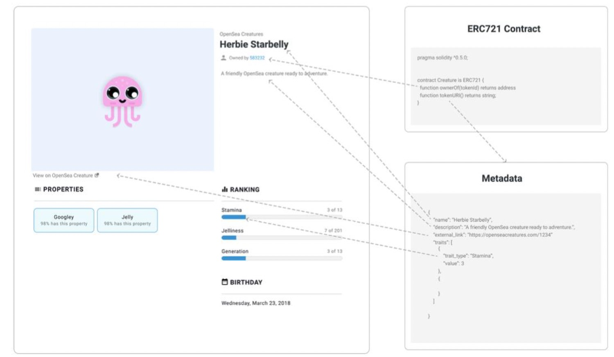

  This standard enables NFTs to be traded on marketplaces and integrated into various applications while maintaining their unique properties and ownership history.

  It provides functionality for <u>minting, transferring, and managing unique tokens, with each token having its own distinct ID and metadata</u>.

  <br>

  **ERC721 Token Standard Interface**

  ```mermaid
  classDiagram
      class ERC721 {
          +string name
          +string symbol
          -mapping(uint256 => address) _owners
          -mapping(address => uint256) _balances
          -mapping(uint256 => address) _tokenApprovals
          -mapping(address => mapping(address => bool)) _operatorApprovals
          
          +balanceOf(address owner) uint256
          +ownerOf(uint256 tokenId) address
          +safeTransferFrom(address from, address to, uint256 tokenId, bytes data)
          +safeTransferFrom(address from, address to, uint256 tokenId)
          +transferFrom(address from, address to, uint256 tokenId)
          +approve(address to, uint256 tokenId)
          +setApprovalForAll(address operator, bool approved)
          +getApproved(uint256 tokenId) address
          +isApprovedForAll(address owner, address operator) bool
      }
  ```


<br>


  ERC20 VS ERC721

  Key differences between ERC20 and ERC721:

  | Feature | ERC20 (Fungible) | ERC721 (Non-Fungible) |
  |---------|------------------|----------------------|
  | Uniqueness | All tokens identical | Each token unique |
  | Divisibility | Can be split (e.g., 0.5) | Cannot be split |
  | ID | No individual IDs | Each token has unique ID |
  | Value | Equal value per token | Value varies by token |
  | Transfer | Simple transfer | Transfer with specific ID |
  | Use Case | Currency, shares | Collectibles, art, property |

<br>

### Vulnerability
| Level      | Cause of Vulnerability | Simple Example                                                                                                                               |
| :--------- | :--------------------- | :------------------------------------------------------------------------------------------------------------------------------------------- |
| **Solidity** | Call to the unknown    | A contract calls an external address provided by a user. If the user provides the address of a malicious contract, it could execute harmful code. |
|            | Gasless send           | Using `address.send(amount)` which only forwards 2300 gas. If the recipient is a contract needing more gas in its fallback function, the send fails silently (older Solidity) or reverts. |
|            | Exception disorders    | In older Solidity versions (<0.8.0), external calls failing didn't automatically revert the parent transaction, potentially leaving the contract state inconsistent if not handled carefully. |
|            | Type casts             | Incorrectly converting between types, e.g., casting a large `uint256` to `uint32` might truncate the value, leading to unexpected behaviour or overflow/underflow issues. |
|            | Reentrancy             | A contract sends Ether to another contract. Before updating its own balance, the receiving contract calls back into the original one, withdrawing funds again. |
|            | Keeping secrets        | Storing a "secret" value (like the answer to a puzzle or a private key) directly in a contract variable. All blockchain data is public.      |
| **EVM**      | Immutable bugs         | Deploying a contract with a critical flaw in its logic (e.g., allowing anyone to withdraw funds). The bug cannot be fixed in the deployed instance. |
|            | Ether lost in transfer | Sending Ether via `selfdestruct(target)` where `target` is a contract without a payable fallback/receive function; the Ether gets stuck.      |
|            | Stack size limit       | A function makes too many nested internal or external calls (depth > 1024), causing the transaction to fail due to exceeding the EVM stack limit. |
| **Blockchain** | Unpredictable state    | A lottery contract uses `block.number` to determine the winner. A miner could potentially manipulate which block includes the transaction to influence the outcome slightly. |
|            | Generating randomness  | Using `block.timestamp` or `blockhash` as a source of randomness for a game. Miners can influence these values, making the outcome predictable or manipulable. |
|            | Time constraints       | Relying on `block.timestamp` for precise timing. A contract might require an action within a 60-second window, but block times can vary, making this unreliable. |

#### Reentrancy Attacks
 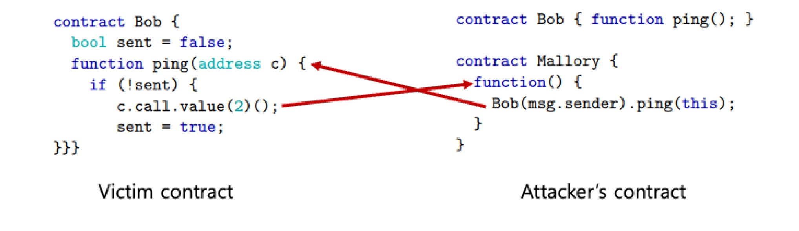

**Example Breakdown:**

Initiation: The attacker (controlling the Mallory contract or an external account) calls the ping function on the Bob contract, passing the address of the Mallory contract as the argument c.
Bob.ping(address(Mallory))

Bob's ping Execution (First time):

The ping function in Bob starts.

bool sent is currently false.

The if (!sent) condition is true (since !false is true), so the code inside the if block executes.

`c.call.value(2)()`: This is the crucial step. Bob attempts to send 2 wei (a tiny amount of Ether) to the address c (which is the Mallory contract). This is an external call that transfers value.

Mallory's Fallback Function Triggered:

When a contract receives Ether via a low-level .call (or .send or .transfer) and no specific function data is provided (like in c.call.value(2)()), its fallback function is automatically executed. In this case, Mallory has a fallback function defined as function() { ... }.

Because Bob just sent value (value(2)) without calling a named function on Mallory, the EVM executes Mallory's fallback function.

Mallory Executes Malicious Code:

Inside Mallory's fallback function, the line `Bob(msg.sender).ping(this)`; executes.

msg.sender within Mallory's fallback function is the address of the contract that called it and sent the Ether – which is the Bob contract.

Bob(msg.sender) casts Bob's address back to the Bob contract type.

.ping(this): Mallory calls the ping function on the Bob contract again, passing its own address (this) as the argument c.

Bob's ping Execution (Second time - Re-entered):

The ping function in Bob starts executing again, before the first execution finished.

Crucially, the line sent = true; from the first call to ping has not yet executed. It only happens after the c.call.value(2)() completes.

Therefore, bool sent is still false for this second execution.

The if (!sent) condition is true again.

c.call.value(2)(): Bob attempts to send another 2 wei to Mallory.

The Loop: This triggers Mallory's fallback function again, which calls Bob.ping again, and the cycle repeats. Each time Bob.ping is re-entered, the sent flag is still false, allowing another Ether transfer via c.call.value(2)() before the state is updated.

Why it's a Vulnerability (Reentrancy):

The vulnerability lies in the order of operations within Bob's ping function:

Check condition (if (!sent)).

Perform external interaction (`c.call.value(2)()`). <-- Vulnerable point

Update state (sent = true;).

The external call (c.call.value(2)()) transfers execution control to the Mallory contract. Mallory uses this opportunity to call back (re-enter) the ping function before Bob could update its state (sent = true). This allows bypassing the check that was intended to prevent multiple payouts.

#### Reentrancy Mitigation
1. Checks-Effects-Interaction Pattern
   - Performs all necessary checks and updates the contract’s state before interacting with external addresses or other contracts
2. Reentrancy Guard
   - A variable (like locked) to prevent multiple function calls from entering the function at once

#### Stack Size Limit
* Each time a contract invokes another contract, the call stack grows by one frame
* The call stack is bounded to 1024 frames (a further invocation throws an exception)
  * e.g. Denial of service, griefing, breaking expected logic etc

In Simple Terms: You can only stack things so high. In Ethereum, you can only make 1024 nested function calls deep within a single transaction. If you try to make the 1025th call, the whole operation fails. Attackers can sometimes force legitimate actions to hit this limit, preventing them from succeeding (Denial of Service).

#### Blockchain Level Unpredictable State

**Core Idea:**
- A set of transactions updating the same contract state can be included in the same block
- The order of transactions may affect on the contract state

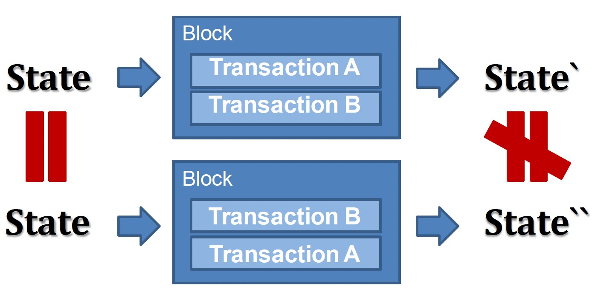

### Client(Node) APIs
- Anyone can run a node on public blockchain

#### Types of Ethereum Nodes
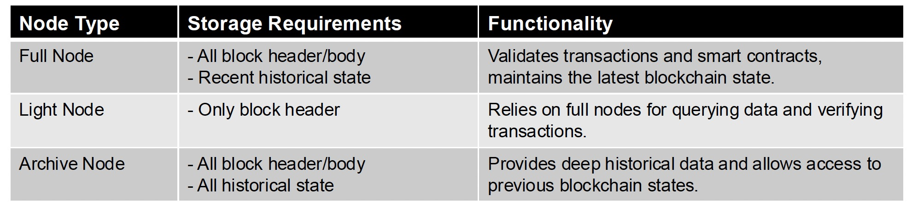

#### Frequently used APIs
* Query blockchain state:
  * `eth_blockNumber` - Get latest block number
  * `eth_getBlockByNumber` - Fetch block data
  * `eth_getTransactionByHash` - Get transaction details
  * `eth_getTransactionReceipt` - Get transaction receipt
  * `eth_getBalance` - Get balance of an account
* Interact with smart contracts
  * `eth_call` - Execute contract function without sending transaction
  * `eth_estimateGas` - Estimate gas for transaction
* Send transactions:
  * `eth_sendTransaction` - Send a new transaction (requires unlocked account)
  * `eth_sendRawTransaction` - Send a signed transaction
* Subscription-based methods (for WebSockets):
  * `eth_subscribe` - Subscribe to real-time blockchain events
* Debug APIs
  * `debug_traceTransaction`: Simulates a transaction without broadcasting it to the network, providing detailed execution traces for debugging.
  * `debug_traceCall`: Retrieves the execution trace of a past transaction, showing opcodes, gas usage, and internal calls.

### Ethereum Characteristics

#### EVM bytecode
- Solidity code is compiled by the Solidity compiler into bytecode
- The bytecode is executed within the Ethereum Virtual Machine (EVM), with the majority of it being stored in the smart contract account

#### ABI (Application Binary Interface)

ABI defines the structure of smart contracts
- Function names & parameters (input/output types)
- Event signatures (used for logging)
- State variable types (for interacting with storage)

Dapps can call contract functions and decode return values using ABI
- Every function call in Ethereum requires ABI encoding
- The first 4 bytes represent a function selector (function signature)
- The following bytes are parameter values
- Example) keccak256("setValue(uint256)")[:4]
  - 0x60fe47b1000000000000000000000000000000000000000000000000000000000000002a

---

### Wallets